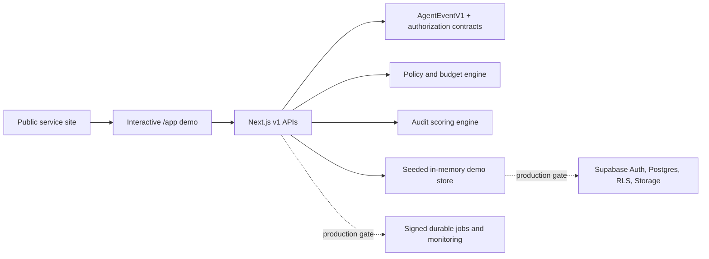

# Agent Fleet Audit

Agent Fleet Audit is a polished concept project and working deterministic demo for a productized multi-agent production-readiness service. It combines a public services website, an interactive control-plane dashboard, provider-neutral telemetry contracts, policy and audit engines, and versioned demonstration APIs.

> **Project status:** portfolio- and sales-demo ready. The landing page and `/app` dashboard are functional; the backend intentionally uses seeded data and in-memory state. It is not presented as a production SaaS, security certification, penetration test, or compliance certification.

## Live experience

- Public website: `/`
- Interactive control plane: `/app`
- Demonstration workflow: vendor-risk review with traces, policy decisions, cost state, approvals, and report export
- Latest protected design preview: <https://agent-fleet-audit-mfgyw0hon-anilandcodes-projects.vercel.app>

Source repository: <https://github.com/anilandcode/agent-fleet-audit> (private). Production promotion and a custom domain remain separate release decisions.

## What works now

- Responsive reference-led landing page with original Agent Fleet Audit branding and generated artwork.
- Interactive tenant-scoped demo workspace with fleet inventory, traces, budgets, policies, findings, approvals, and JSON report export.
- Canonical `AgentEventV1` telemetry contract with an OpenTelemetry-ready mapping boundary.
- Deterministic policy decisions: `allow`, `deny`, `require_approval`, and `throttle`.
- Audit scoring across architecture, observability, cost governance, security, and reliability.
- Versioned APIs for event ingestion, authorization, budget reservation/reconciliation, approvals, audits, workflow execution, platform snapshots, leads, and reports.
- Validated diagnostic intake with optional `LEAD_WEBHOOK_URL` delivery.
- Contract coverage for policy outcomes, audit scoring, redaction, and lead validation.

## Architecture at a glance



See [Architecture](docs/ARCHITECTURE.md) for the data flow, trust boundaries, APIs, and production target.

## Local development

Requirements: Node.js 24 and pnpm 10.

```bash
pnpm install
cp .env.example .env.local
pnpm dev
```

Open `http://localhost:3000` and `http://localhost:3000/app`.

```bash
pnpm verify
```

`pnpm verify` runs TypeScript, contract checks, and the production build.

## Documentation

| Document | Purpose |
| --- | --- |
| [Documentation index](docs/README.md) | Authoritative map of project documents |
| [Design system](DESIGN.md) | Current visual language, responsive layout, assets, and motion rules |
| [Architecture](docs/ARCHITECTURE.md) | Implemented backend boundaries and production target |
| [Demo guide](docs/DEMO_GUIDE.md) | Honest 60–90 second sales-demo walkthrough |
| [Development and validation](docs/DEVELOPMENT.md) | Setup, commands, checks, and contribution workflow |
| [Deployment](docs/DEPLOYMENT.md) | Vercel preview/production behavior and environment configuration |
| [Production readiness](docs/PRODUCTION_READINESS.md) | Current maturity, limitations, and acceptance gates |
| [Generated asset inventory](docs/ASSET_INVENTORY.md) | Used, unused, and reference image provenance |
| [Visual source library](assets/visual-library/README.md) | Full-resolution recoverable masters, inspiration copies, and checksums |
| [Production gates](docs/production-gates.md) | External systems and rehearsals required before live enforcement |
| [Research](agent-fleet-audit-research.md) | Market and service-category research |
| [Original end-to-end plan](multi-agent-architecture-end-to-end-plan.md) | Product, offer, demo, and delivery rationale |

Historical validation handoffs are retained as snapshots. Current truth lives in the documents above and the source code.

## Production boundary

The deployed demo is deterministic by design. It does not yet run a live orchestrator or specialist-agent fleet, and it does not persist governance state across server instances. Production use requires Supabase Auth/Postgres/RLS/Storage, signed background jobs, distributed rate limiting, monitoring and alerting, an approved model provider, live abuse testing, backup/restore rehearsals, and a durable lead destination. See [Production readiness](docs/PRODUCTION_READINESS.md).

## Visual assets and references

- Active generated images: `public/media/agent-fleet/{reference-clone,visual-correction,visual-expansion}/`
- Retained unused generated variants: `public/media/agent-fleet/archive/unused/`
- User-supplied inspiration screenshots: `Images/`
- Full-resolution recoverable source library: `assets/visual-library/` (37 generated masters and 12 reference copies; never publicly served)
- Complete status and provenance: [Asset inventory](docs/ASSET_INVENTORY.md)

Generated assets contain no embedded customer logos, third-party branding, or copied reference text. Reference imagery informed layout, material, and atmosphere only.

## Source reuse record

The project adapts generalized patterns from the owner’s prior systems without carrying over customer data, credentials, or private source code. See [Reuse audit](docs/reuse-audit.md).
