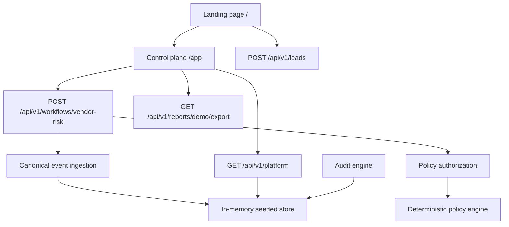
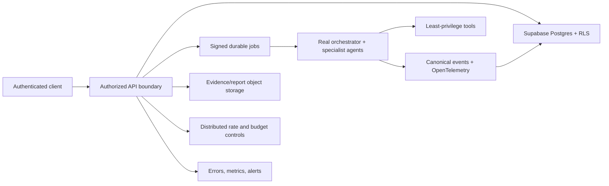

# Architecture

## System purpose

Agent Fleet Audit demonstrates how a multi-agent system can expose traceable events, policy decisions, budgets, approval requirements, audit findings, and evidence. The current implementation is a deterministic functional prototype designed to sell and explain an architecture service; it is not yet a durable multi-tenant control plane.

## Implemented runtime

### Presentation layer

- Next.js App Router serves the public landing page and `/app` dashboard.
- React components render the deterministic vendor-risk scenario and operational snapshot.
- GSAP handles page-level scroll choreography; Motion for React handles component interactions.

### API layer

All product APIs are versioned under `/api/v1`:

| Endpoint | Behavior today |
| --- | --- |
| `GET /platform` | Returns the seeded tenant, budget, audit, and event snapshot |
| `POST /workflows/vendor-risk` | Runs a deterministic six-event vendor-risk scenario |
| `POST /ingest/events` | Validates and appends canonical events with duplicate detection |
| `POST /authorize` | Evaluates policy and returns an idempotent decision |
| `POST /budgets/reserve` | Wraps authorization as a demo reservation |
| `POST /budgets/reconcile` | Validates reconciliation input; no durable ledger yet |
| `POST /approvals` | Validates and returns a parameter-bound approval record; no persistence yet |
| `POST /audits` | Returns the seeded audit result and evidence |
| `GET /reports/demo/export` | Downloads a seeded redacted JSON report |
| `POST /leads` | Validates intake and optionally forwards it to `LEAD_WEBHOOK_URL` |

### Contracts and engines

- `AgentEventV1` is the provider-neutral event contract for runs, model calls, tools, retrieval, handoffs, policy, budgets, approvals, errors, and evaluations.
- Authorization evaluates kill switch, blocked tools, remaining workspace/agent budgets, action class, risk, high-risk tools, and approval thresholds.
- Audit scoring evaluates architecture, observability, cost, security, and reliability evidence.
- Redaction removes recognized secrets and normalizes email values before storage.

### Storage boundary

`lib/store.ts` is process-local state initialized from seeded fixtures. It validates the fixed demonstration workspace, redacts attributes, deduplicates events, and caches authorizations by idempotency key. State can reset on server restart or across serverless instances.

The Supabase migration defines the intended organizations, memberships, workspaces, fleets, agent events, policy versions, authorizations, approvals, and audit reports, plus initial RLS policies. The application does not yet instantiate a Supabase client or use these tables.

## Trust boundaries

- Browser input is validated by Zod at API boundaries.
- Demo tenancy is checked against the single seeded tenant; it is not authenticated tenancy.
- Authorization and budget results are deterministic and local, not distributed enforcement.
- Approval and reconciliation endpoints validate shape but do not yet consume durable single-use records.
- Report provenance is explicitly marked `SEEDED_DEMO_DATA`.
- Diagnostic leads are durable only when an approved webhook is configured.

## Production target

Moving to this target requires the acceptance gates in `PRODUCTION_READINESS.md` and `production-gates.md`; the schema alone does not make the current demo production ready.
